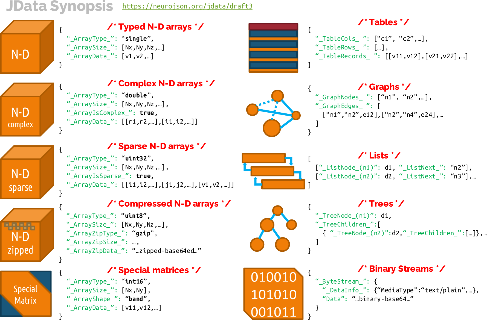

# JData Format Specification Development Guide

We use this repository to gather feedback from the community regarding the 
["JData Format Specification"](JData_specification.md), or JData format. Such 
feedback is crucial to finalize this file specification and help improve
it in the future once disseminated. 

The latest version of the JData specification can be found in the file named 
[JData_specification.md](JData_specification.md). The specification is written
in the [Markdown format](https://github.com/adam-p/markdown-here/wiki/Markdown-Cheatsheet) 
for convenient editing and version control.

## What is JData

JData defines a set of **standardized**, **lightweight** and **language-neutral** annotations
to encode and interchange general-purpose data structures between programming
environments, such as Python, C, C++, and MATLAB. JData converts complex data structures,
such as N-D arrays, sparse arrays, complex-valued arrays, lists, trees, and graphs,
into a set of JSON-like `"name": value` pairs so that they can be losslessly serialized
into JSON and binary JSON files for data sharing. Via simple annotation tags, JData also
supports encoding strongly typed binary data as well as compressed data.

JData-encoded data can be stored in human-readable JSON format, as well as in binary
JSON format BJData/UBJSON for smaller file size and faster parsing. These data files
are JSON/BJData compliant and can be readily read without needing one to write their
own format. There exist numerous JSON parsers, abundant BJData/UBJSON parsers, and
extensively developed tools in the large JSON ecosystem - including utilities like
as `jq`, JSON-native NoSQL databases, and JSON-based standards such as JSON-schema
for validation, JSON-Reference and JSON-LD for data linking, JSON-Path for query etc.

## How to participate

You can use a number of methods to provide your feedback to the working 
draft of this file specification, including

- [Create an "Issue"](https://github.com/NeuroJSON/jdata/issues)
  - This is the most recommended method to provide detailed feedback or 
    discussion. An "Issue" in github is highly versatile. One can ask a 
    question, report a bug, provide a feature request, or simply propose
    general discussions. Please use URLs or keywords to link your discussion 
    to a specific line/section/topic in the document.
- [Write short comments on Request for Comments (RFC) commits](https://github.com/NeuroJSON/jdata/commit/6bb02c8a654938451d686c4a7c2b1b0619e7cf17)
  - A milestone version of the specification will be associated with an
    RFC (Request for comments) commit (where the entire file is removed
    and re-added so that every line appears in such commit). One can
    write short comments as well as post replies on this RFC page. 
  - The latest RFC commit is based on **Draft 2 (version v0.8)**. Please use
    [this link](https://github.com/NeuroJSON/jdata/commit/6bb02c8a654938451d686c4a7c2b1b0619e7cf17) to comment.
  - To add a comment, you need to first register a github account, and then 
    browse the above RFC page. When hovering your cursor over each line, a 
    "plus" icon is displayed, clicking it will allow one to comment on a 
    specific line (or reply to other's comments).
  - The RFC page can get busy if too many comments appear. Please consider 
    using the [Issues section](https://github.com/NeuroJSON/jdata/issues) if this happens.
  - One can browse the commit history of the specification document. If
    anyone is interested in commenting on a particular updated, you can also
    comment on any of the commit page using the same method.
- [Use NeuroJSON mailing list](https://groups.google.com/forum/#!forum/neurojson)
  - You may send your comments to the neurojson mailing list (neurojson at googlegroups.com). 
    Subscribers will discuss by emails, and if a motion is reached, proposals
    will be resubmitted as an Issue, and changes to the specification will be
    associated with this issue page.

For anyone who wants to contribute to the writing or revision of this document,
please follow the below steps

- Fork this repository and make updates, then create a pull-request
  - Please first register an account on github, then, browse the 
    [JData repository](https://github.com/NeuroJSON/jdata);
    on the top-right of this page, find and click the "Fork" button.
  - once you fork the JData project to your own repository, you may edit the
    files in your browser directly, or download to your local folder, and 
    edit the files using a text editor;
  - once your revision is complete, please "commit" and "push" it to your forked
    git repository. Then you should create a pull-request against the upstream
    repository (i.e., `NeuroJSON/jdata`). Please select "Compare cross forks" and 
    select `"NeuroJSON/jdata"` as "base fork". Please write a descriptive title for
    your pull-request. The project maintainer will review your updates
    and choose to merge to the upstream files or request revision from you.
    
